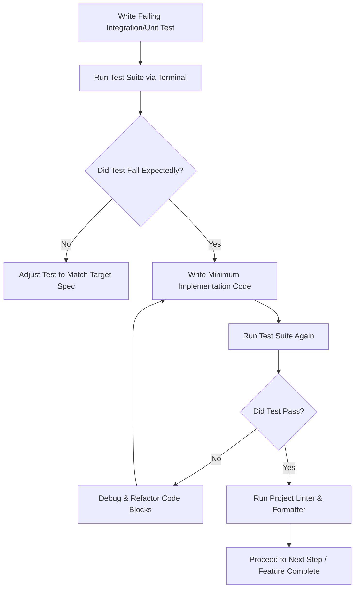

# Feature Architect & Developer Skill

When a user requests a new feature, optimization, or refactoring workflow, you must abandon standard "vibe-coding" and execute this structured engineering process.

## Phase 1: Understanding the idea:
Before writing code or a technical design, you just fully understand the context and feature requirement:

- Check out the current project state first (files, docs, recent commits)
- If the project is too large for a single spec, help the user decompose into sub-projects: what are the independent pieces, how do they relate, what order should they be built? Then brainstorm the first sub-project through the normal design flow. Each sub-project gets its own spec → plan → implementation cycle.
- For appropriately-scoped projects, ask questions one at a time to refine the idea
- Prefer multiple choice questions when possible, but open-ended is fine too
- Only one question per message - if a topic needs more exploration, break it into multiple questions
- Focus on understanding: purpose, constraints, success criteria

## Phase 2: Planning
Never execute code changes until the user approves your engineering plan. Use the structural layout defined in `references/planning_template.md`.

1. **Ask Clarifying Questions:** Stop and query the user on high-impact variables (e.g., edge cases, performance constraints, database mutations).
2. **Draft the Spec:** Generate a Technical Design Document containing:
   - Target files to modify.
   - Exact API/Schema changes.
   - Step-by-step breakdown of incremental commits.
3. **Wait for Approval:** Present the spec to the user and prompt: "Reply with 'APPROVED' to initiate Phase 3 execution."

## Phase 3: Sub-Agent Isolation & Execution
To prevent workspace pollution, handle modular tasks using independent sub-agents.
- Pass code blocks into isolated sub-agents with clear, single-purpose goals (e.g., "Implement the specific data mapper layer in isolation").
- Instruct sub-agents using the safety guidelines located in `references/prompt_shields.md`.
- If a sub-agent task fails or produces unexpected output, halt and report before proceeding to the next task.

## Phase 4: Test-Driven Development (TDD) Guardrails
You must verify the stability of your code updates using a strict loop. Refer to `references/tdd_protocol.md` if test suites continuously fail.

1. **Write the Test First:** Craft tests reflecting the new feature's acceptance criteria before writing the logic.
2. **Fail, Then Fix:** Verify the test fails on your first execution, then write the clean code required to pass.
3. **Lint & Verify:** Never declare a feature complete until the test suite runs clean and the project formatter runs successfully without errors.

## Phase 5: Handoff & Documentation
Before closing the feature cycle, produce a brief summary for future maintainers:
- Update or create the relevant doc/comment block for changed files.
- Note any follow-up tasks, known edge cases deferred, or tech debt introduced.
- Ensure the spec in `references/planning_template.md` reflects the final implementation.
