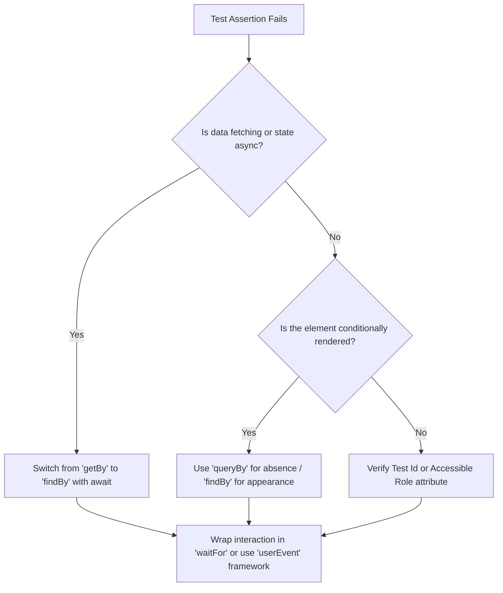

# Frontend Test-Driven Development (TDD) Emergency Protocol

If a test suite fails during the implementation loop, DO NOT repeatedly rewrite the component logic. Execute this strict diagnostic protocol to identify whether the bug lives in the Component Logic, the Asynchronous State Engine, or the Test Environment Setup itself.

## 1. The Red-Green-Refactor Loop Standard
You must strictly isolate your workflow stages. Never move to the next stage until the current condition is completely met:
1. **RED:** Write an intentional, failing test block that asserts the new UI layout or user interaction.
2. **GREEN:** Write the minimal clean JSX/TSX and state mechanics to make that specific test pass.
3. **REFACTOR:** Clean up utility styles, remove redundant re-renders, optimize TypeScript types, and execute project formatting rules.

## 2. Asynchronous & DOM Query Diagnostic Tree
When assertions on user interactions or API data updates fail, debug the DOM query methodology step-by-step:



### Mandatory Query Substitutions:
* **NEVER** use `getByText` or `getByRole` for elements that appear *after* a network request or a timed state transition. Switch immediately to `await findByText` or `await findByRole`.
* **NEVER** use `getBy` or `findBy` to assert that an element has successfully disappeared from the UI (e.g., a loading spinner turning off). Use `expect(queryByText(...)).not.toBeInTheDocument()` to avoid throwing runtime testing exceptions.

## 3. Mocking & Context Engine Safeguards
Frontend components rely heavily on global providers. If a test throws errors related to missing hooks, undefined states, or network failures, check these integration wrappers:
* **Global Context Wrappers:** Ensure the component under test is cleanly mounted within its necessary provider trees (e.g., `ThemeProvider`, `QueryClientProvider`, or routing contexts). Use a custom test render utility if available.
* **Network Interception Rules:** Do not allow components to hit live API network addresses during tests. Stub all network operations using structural mock engines (e.g., Mock Service Worker (MSW), Jest/Vitest spy functions, or local network fixtures).
* **Timer & Animation Halts:** If the functionality depends on debounce sequences, throttles, or UI animations, force the testing framework to use fake clocks (`vi.useFakeTimers()` or `jest.useFakeTimers()`) to fast-forward through the latency blocks.

## 4. Maximum Failure Limit & Human Intervention Halt
* **The 3-Strike Threshold:** If the exact same test sequence fails **three consecutive times** despite code modifications, you must stop the automation cycle immediately.
* **The Escalation Message:** Output a detailed diagnostic error breakdown to the chat terminal interface. Do not edit any more files. Use the following reporting layout to alert the user:

```text
🛑 TDD LOOP HALTED: Maximum failure limit reached.
- Target Test File: [Path to test file]
- Failing Assertion: [Line number and assertion text]
- Discovered Structural Block: [Explain why the mock, state, or DOM structure is breaking]
- Proposed Architectural Adjustments: [Provide 2 distinct solutions for the developer to review]
```
