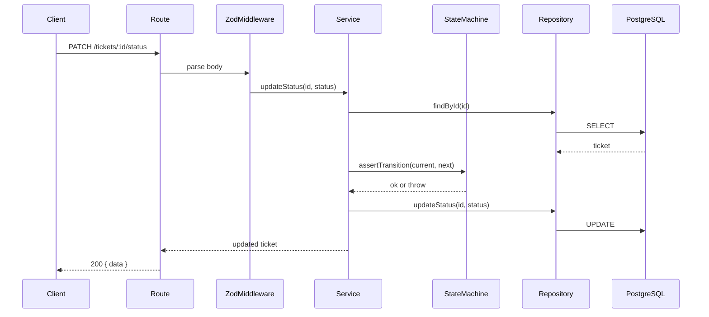
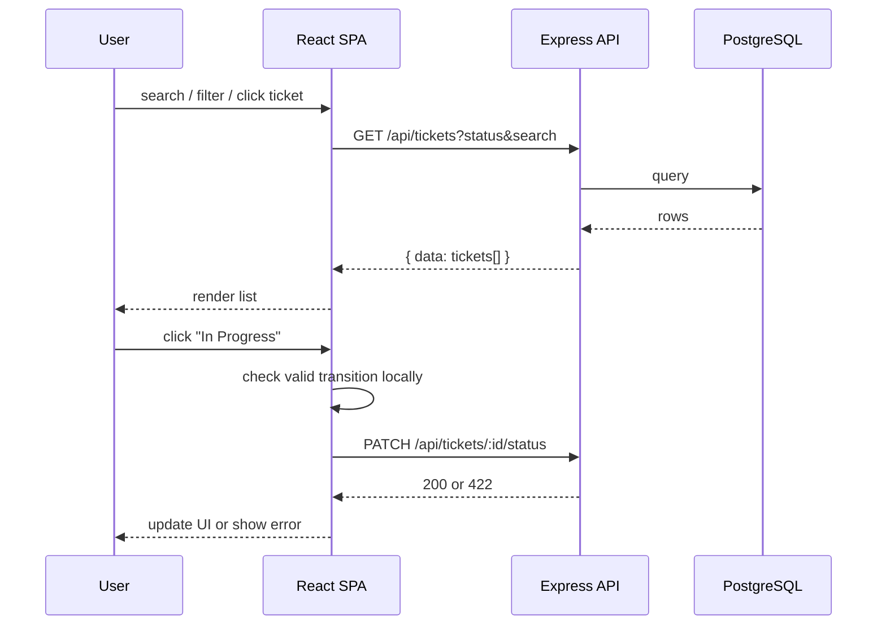

# Architecture — Support Ticket Management System

## Data layer (Step 1) — complete

```
┌─────────────┐     ┌──────────────┐     ┌─────────────────┐
│  Frontend   │────▶│   Backend    │────▶│  PostgreSQL 16  │
│  (React)    │     │  (Node.js)   │     │  via Prisma     │
└─────────────┘     └──────────────┘     └─────────────────┘
      ▲                     │
      │              Repository + Service
      │              (Step 2 — done)
      └──── fetch /api ────┘
```

### Layer responsibilities

| Layer | Location | Responsibility |
|-------|----------|----------------|
| Database | `database/` | Schema, migrations, seeds, Docker |
| Prisma Client | `database/` | Type-safe DB access |
| Repository | `backend/src/repositories/` | Isolate queries from routes |
| Service | `backend/src/services/` | State machine, business rules |
| API | `backend/src/routes/` | HTTP handlers + validation |
| **UI** | `frontend/src/` (Step 3) | Pages, components, API client |

### Database package (`database/`)

- `docker-compose.yml` — local Postgres with named volume (data survives restart)
- `prisma/schema.prisma` — models, enums, indexes
- `prisma/migrations/` — versioned SQL
- `prisma/seed.ts` — sample users, tickets, comments

### Connection

- Single `PrismaClient` instance at backend startup (connection pooling built-in)
- `DATABASE_URL` from `.env` — validated at boot
- No raw SQL in route handlers (`.cursor/rules/database-patterns.mdc`)

### Handoff to Step 2

Backend will:
1. Import `@prisma/client` from `database/` workspace
2. Create repositories: `userRepository`, `ticketRepository`, `commentRepository`
3. State machine service reads/writes `Ticket.status` — DB stores value only

---

## Backend layer (Step 2) — planned

### Folder structure

```
backend/
├── package.json
├── tsconfig.json
├── .env.example
├── README.md
└── src/
    ├── index.ts              # entry — start server
    ├── app.ts                # express app factory
    ├── config/
    │   └── env.ts            # validate DATABASE_URL, PORT
    ├── lib/
    │   └── prisma.ts         # singleton PrismaClient
    ├── errors/
    │   ├── AppError.ts
    │   ├── NotFoundError.ts
    │   ├── ValidationError.ts
    │   └── InvalidTransitionError.ts
    ├── middleware/
    │   ├── validate.ts
    │   └── errorHandler.ts
    ├── repositories/
    │   ├── userRepository.ts
    │   ├── ticketRepository.ts
    │   └── commentRepository.ts
    ├── services/
    │   ├── ticketStateMachine.ts
    │   ├── ticketService.ts
    │   └── commentService.ts
    ├── validators/
    │   ├── ticketValidators.ts
    │   └── commentValidators.ts
    └── routes/
        ├── health.ts
        ├── users.ts
        └── tickets.ts
└── tests/
    └── integration/
        ├── ticketStateMachine.test.ts
        └── tickets.integration.test.ts
```

### Monorepo wiring

Root `package.json`:
```json
{ "workspaces": ["database", "backend"] }
```

`backend/package.json`:
```json
{ "dependencies": { "database": "file:../database" } }
```

Import: `import { PrismaClient, TicketStatus } from 'database'` or `@prisma/client` re-exported from database package.

### Request lifecycle



### Security (Core)

- `helmet` middleware
- CORS open for local dev (`localhost:5173` frontend later)
- No auth — `createdById` sent in request body (seeded users only)
- Rate limiting = Stretch

### Implementation order

1. Scaffold + env + prisma singleton
2. Errors + error handler middleware
3. State machine (unit tests first — TDD)
4. Repositories
5. Services
6. Validators + routes
7. Integration tests
8. README

### Approval gate

**Status:** Implemented 2026-07-14. All 21 tests passing.

---

## Frontend layer (Step 3) — planned

### System flow



### Monorepo update

Root `package.json` workspaces add `frontend`:

```json
{ "workspaces": ["database", "backend", "frontend"] }
```

### Ports

| Service | URL |
|---------|-----|
| Frontend (Vite) | `http://localhost:5173` |
| Backend API | `http://localhost:3001/api` |
| Postgres (Docker) | `localhost:5433` |

Backend CORS already allows `localhost:5173`.

### Frontend stack

| Piece | Choice | Why |
|-------|--------|-----|
| Framework | React 18 | Requirements allow React |
| Build | Vite | Fast dev, TS native |
| Language | TypeScript strict | Match backend |
| Router | react-router-dom v6 | 3 pages |
| State | Context + hooks | Small app. No Redux. |
| Styling | CSS modules or plain CSS | Simple. No new design lib. |
| Tests | Vitest + RTL | Match backend test runner |
| HTTP | native `fetch` | No axios needed |

### Data flow rules

1. **Pages** own route-level data fetch via hooks
2. **Hooks** call `api/` modules — no fetch in components
3. **Components** receive props, emit events — thin UI
4. **Context** only for acting user (shared across pages)
5. **State machine utils** pure — no React imports

### Implementation order

| Step | Task |
|------|------|
| 3.1 | Scaffold Vite React TS in `frontend/` |
| 3.2 | Add to npm workspaces, `.env.example`, `.nvmrc` |
| 3.3 | Types + API client + error parsing |
| 3.4 | `ticketStateMachine.ts` utils (mirror backend) |
| 3.5 | `UserContext` + `ActingUserSelect` |
| 3.6 | Layout + React Router routes |
| 3.7 | `TicketListPage` + filters + search |
| 3.8 | `CreateTicketPage` + `TicketForm` |
| 3.9 | `TicketDetailPage` — edit, status, comments |
| 3.10 | Error/loading/empty states |
| 3.11 | RTL component tests |
| 3.12 | `frontend/README.md` + root README update |

### Approval gate

**Status:** Implemented 2026-07-14. 9 tests passing. Build OK.

