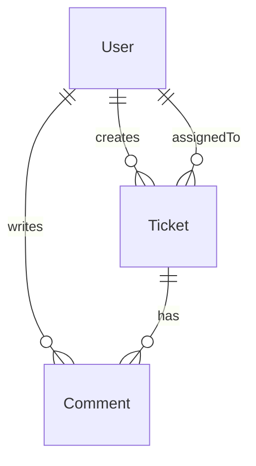

# Data Model

## Entities (Requirements Core)

### User (seeded only — no user-management UI)

| Field | Type | Notes |
|-------|------|-------|
| id | UUID | Primary key |
| name | string | Required |
| email | string | Required, unique |
| role | enum | `AGENT`, `ADMIN`, `REQUESTER` |

### Ticket

| Field | Type | Notes |
|-------|------|-------|
| id | UUID | Primary key |
| title | string | Required, max 200 (app validation) |
| description | string | Required |
| priority | enum | `LOW`, `MEDIUM`, `HIGH`, `CRITICAL` |
| status | enum | Default `OPEN` |
| assignedTo | FK → User | Nullable (unassigned allowed) |
| createdBy | FK → User | Required |
| createdAt | datetime | Auto |
| updatedAt | datetime | Auto |

### Comment

| Field | Type | Notes |
|-------|------|-------|
| id | UUID | Primary key |
| ticketId | FK → Ticket | Required, cascade delete |
| message | string | Required |
| createdBy | FK → User | Required |
| createdAt | datetime | Auto |

## Status State Machine

Enforced in **backend service** (not DB constraint):

```
OPEN         → IN_PROGRESS
IN_PROGRESS  → RESOLVED
RESOLVED     → CLOSED
OPEN         → CANCELLED
IN_PROGRESS  → CANCELLED
```

Terminal states: `CLOSED`, `CANCELLED` — no outbound transitions.

## Requirements ↔ implementation mapping

### Status names

| Requirements (prose) | Stored / API value | UI label |
|----------------------|-------------------|----------|
| Open | `OPEN` | Open |
| In Progress | `IN_PROGRESS` | In Progress |
| Resolved | `RESOLVED` | Resolved |
| Closed | `CLOSED` | Closed |
| Cancelled | `CANCELLED` | Cancelled |

### Relation field names

| Requirements entity field | DB column | API write | API read |
|---------------------------|-----------|-----------|----------|
| `assignedTo` | `assigned_to_id` | `assignedToId` | `assignedTo` (nested User) |
| `createdBy` | `created_by_id` | `createdById` | `createdBy` (nested User) |
| `ticketId` (Comment) | `ticket_id` | path param `:id` | `ticketId` |

See [`api-contract.md`](api-contract.md) for full endpoint shapes.

## ER Diagram



## Implementation

- **Schema:** [`database/prisma/schema.prisma`](database/prisma/schema.prisma)
- **Migration:** [`database/schema-or-migrations/`](database/schema-or-migrations/)
- **Seed data:** [`database/seed-data/`](database/seed-data/) — 4 users, 8 tickets, 7 comments
