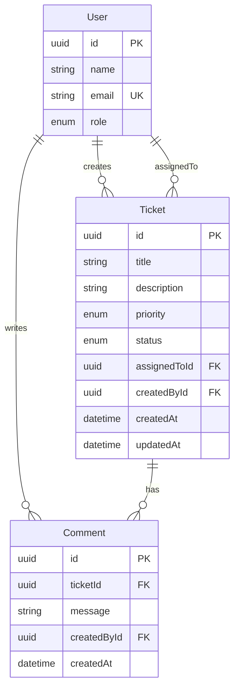

# Design — Support Ticket Management System

## Database design (Step 1)

**Stack:** PostgreSQL 16 + Prisma ORM  
**Location:** `database/prisma/`

### ER diagram



### Enums

| Enum | Values |
|------|--------|
| `UserRole` | `AGENT`, `ADMIN`, `REQUESTER` |
| `TicketPriority` | `LOW`, `MEDIUM`, `HIGH`, `CRITICAL` |
| `TicketStatus` | `OPEN`, `IN_PROGRESS`, `RESOLVED`, `CLOSED`, `CANCELLED` |

### Field constraints

**User** — seeded only in Core. No user-management UI.
- `name`, `email`, `role` required
- `email` unique

**Ticket**
- `title`, `description`, `priority`, `createdById` required
- `assignedToId` nullable (unassigned ticket allowed)
- `status` defaults to `OPEN`
- `title` max 200 chars enforced in backend validation (not DB)

**Comment**
- `ticketId`, `message`, `createdById` required
- Cascade delete when ticket deleted

### Status state machine (backend only — NOT in DB)

```
OPEN         -> IN_PROGRESS
IN_PROGRESS  -> RESOLVED
RESOLVED     -> CLOSED
OPEN         -> CANCELLED
IN_PROGRESS  -> CANCELLED
```

DB stores current status. Backend service enforces valid transitions.

### Indexes

| Table | Column | Why |
|-------|--------|-----|
| `tickets` | `status` | Core status filter |
| `tickets` | `assigned_to_id` | FK + stretch assignee filter |
| `tickets` | `created_by_id` | FK |
| `tickets` | `created_at` | List sort |
| `comments` | `ticket_id` | Load comments per ticket |

### Search strategy (Core)

Keyword search on `title` + `description` via `ILIKE` in repository layer. Full-text index = Stretch optional.

---

## Backend API design (Step 2) — planned

**Stack:** Node.js 20 + Express + TypeScript + Zod  
**Location:** `backend/src/`

### Layer flow

```
HTTP Request
    → validate middleware (Zod)
    → route handler (thin)
    → service (business rules)
    → repository (Prisma)
    → PostgreSQL
```

### State machine service

Pure function module. No DB calls.

```typescript
const VALID_TRANSITIONS: Record<TicketStatus, TicketStatus[]> = {
  OPEN: ['IN_PROGRESS', 'CANCELLED'],
  IN_PROGRESS: ['RESOLVED', 'CANCELLED'],
  RESOLVED: ['CLOSED'],
  CLOSED: [],
  CANCELLED: [],
};
```

- `canTransition(from, to)` → boolean
- `assertTransition(from, to)` → throws `InvalidTransitionError`
- Called only from `ticketService.updateStatus()`

### Status vs field updates

| Action | Endpoint | Allowed fields |
|--------|----------|----------------|
| Update fields | `PATCH /api/tickets/:id` | title, description, priority, assignedToId |
| Change status | `PATCH /api/tickets/:id/status` | status only |

Separation keeps state machine enforcement in one place.

### Repository query: search + filter

```sql
WHERE status = $status
  AND (title ILIKE $search OR description ILIKE $search)
```

`search` param optional. `status` param optional. Both combinable.

### Error mapping

| Error class | HTTP | Shape |
|-------------|------|-------|
| Zod validation | 400 | `{ errors: [...] }` |
| NotFoundError | 404 | `{ error: { code, message } }` |
| InvalidTransitionError | 422 | `{ error: { code: 'INVALID_TRANSITION', message } }` |
| Unknown | 500 | `{ error: { code: 'INTERNAL_ERROR', message } }` — no stack |

### Test strategy

| Layer | Tool | What |
|-------|------|------|
| State machine | Vitest unit | All transitions |
| API + DB | Vitest + Supertest integration | HTTP status codes against real DB |

Integration tests seed minimal data per test. Clean tickets in `afterEach`.

---

## Frontend design (Step 3) — planned

**Stack:** React 18 + Vite + TypeScript  
**Location:** `frontend/src/`  
**Status:** Pending human approval. No code yet.

### Requirements mapped (from `Requirements`)

| Requirement | Frontend deliverable |
|-------------|---------------------|
| Frontend application | React SPA in `frontend/` |
| Create ticket | `/tickets/new` form |
| List tickets | `/` ticket list page |
| View ticket details | `/tickets/:id` detail page |
| Update fields + assignee | Edit form on detail page |
| Status via state machine | `StatusActions` — only valid next statuses |
| Add comments | Comment form on detail page |
| Keyword search + status filter | `TicketFilters` on list page |
| Meaningful error states | `ErrorAlert` for 400/404/422/500 |
| Input validation | Client-side before submit (backend still validates) |
| No auth (Core) | `ActingUserSelect` — pick seeded user |
| Tests (Core) | RTL component tests for status UI + errors |

### Caveman UX flow

```
User pick self (header dropdown)
    → see ticket list
    → search / filter status
    → click ticket OR create new
    → detail: edit fields, change status (valid only), add comment
    → errors show clear. no crash.
```

### Pages & routes

| Route | Page | Purpose |
|-------|------|---------|
| `/` | `TicketListPage` | List + search + filter + link to create |
| `/tickets/new` | `CreateTicketPage` | New ticket form |
| `/tickets/:id` | `TicketDetailPage` | View/edit ticket, status, comments |

Router: `react-router-dom` v6.

### Component tree

```
App
└── Layout
    ├── Header
    │   ├── AppTitle
    │   └── ActingUserSelect      # seeded users, no auth
    └── Outlet
        ├── TicketListPage
        │   ├── TicketFilters       # search input + status dropdown
        │   ├── TicketList
        │   │   └── TicketListItem  # row/card per ticket
        │   └── EmptyState / ErrorAlert / LoadingSpinner
        ├── CreateTicketPage
        │   └── TicketForm          # create mode
        └── TicketDetailPage
            ├── TicketForm          # edit mode (no status field)
            ├── StatusActions       # buttons for valid transitions only
            ├── CommentList
            ├── CommentForm
            └── ErrorAlert
```

### State machine in UI (mirror backend)

Same map as backend. Frontend uses it to **show buttons only**. Backend still enforces.

```
OPEN         → [In Progress] [Cancelled]
IN_PROGRESS  → [Resolved] [Cancelled]
RESOLVED     → [Closed]
CLOSED       → (no buttons)
CANCELLED    → (no buttons)
```

File: `frontend/src/utils/ticketStateMachine.ts` — copy transition map from backend logic (pure functions).

On `422 INVALID_TRANSITION` from API → show `ErrorAlert` with server message. Safety net if UI wrong.

### Acting user (no auth)

Core has no login. UI needs `createdById` for create + comments.

- `UserContext` — selected user id + name
- Persist in `localStorage` key `actingUserId`
- Default: first user from `GET /api/users`
- `ActingUserSelect` in header — change anytime

### API client layer

`frontend/src/api/`

| File | Role |
|------|------|
| `client.ts` | `fetch` wrapper, parse `{ data }`, throw typed errors |
| `ticketsApi.ts` | list, get, create, update, updateStatus |
| `usersApi.ts` | list users |
| `commentsApi.ts` | add comment (via tickets endpoint) |
| `errors.ts` | `ApiError`, `ValidationApiError` types |

Base URL: `import.meta.env.VITE_API_URL` default `http://localhost:3001/api`

### TypeScript types

`frontend/src/types/`

Mirror API responses. Single source from API shapes:

- `User`, `Ticket`, `Comment`, `TicketPriority`, `TicketStatus`
- `ApiSuccess<T>`, `ApiErrorResponse`, `ValidationErrorResponse`

### Custom hooks

| Hook | Purpose |
|------|---------|
| `useUsers` | fetch + cache seeded users |
| `useTickets` | list with filters, refetch |
| `useTicket` | single ticket by id |
| `useActingUser` | context wrapper |

Fetch in hooks. Components stay thin (`.cursor/rules/react-component-design.mdc`).

### Forms & validation

Client validation before API call. Match backend rules:

| Field | Rule |
|-------|------|
| title | required, 1–200 chars |
| description | required, min 1 |
| priority | required enum |
| message (comment) | required, min 1 |

Show field errors from API `400` `errors[]` array on submit failure.

### Error UI states

| HTTP | UI behavior |
|------|-------------|
| 400 | Show field-level errors under inputs |
| 404 | "Ticket not found" + link back to list |
| 422 | Banner: invalid status transition message |
| 500 | Generic "Something went wrong" |
| Network fail | "Cannot reach server. Is backend running?" |

Components: `ErrorAlert` (banner), inline field errors in forms.

Loading: `LoadingSpinner` while fetch in flight.  
Empty: `EmptyState` when list returns 0 tickets.

### Folder layout

```
frontend/
├── package.json
├── vite.config.ts
├── vitest.config.mjs
├── tsconfig.json
├── .env.example
├── .nvmrc                    # 20
├── index.html
├── README.md
└── src/
    ├── main.tsx
    ├── App.tsx
    ├── api/
    ├── components/
    │   ├── layout/
    │   ├── tickets/
    │   ├── comments/
    │   └── common/
    ├── context/
    │   └── UserContext.tsx
    ├── hooks/
    ├── pages/
    ├── types/
    ├── utils/
    │   └── ticketStateMachine.ts
    └── styles/
        └── global.css
└── tests/
    └── components/
        ├── StatusActions.test.tsx
        └── TicketForm.test.tsx
```

### Test strategy (Core)

Tool: **Vitest + React Testing Library**

| Test | Proves |
|------|--------|
| `StatusActions.test.tsx` | OPEN shows 2 buttons. CLOSED shows 0. |
| `StatusActions.test.tsx` | Click calls `onTransition` with correct status |
| `TicketForm.test.tsx` | Empty title blocks submit, shows error |
| `ErrorAlert.test.tsx` | Renders 422 message |

No E2E in Core (Stretch). Backend integration tests already cover state machine on API.

### Out of scope (Core)

- Login / JWT / protected routes (Stretch)
- User CRUD UI (Stretch)
- Filter by priority, assignee (Stretch)
- Pagination, sorting (Stretch)
- Swagger UI (Stretch)
- Fancy design system — clean functional UI enough

### Approval gate

**Status:** Implemented 2026-07-14. 9 frontend tests passing. Production build OK.

